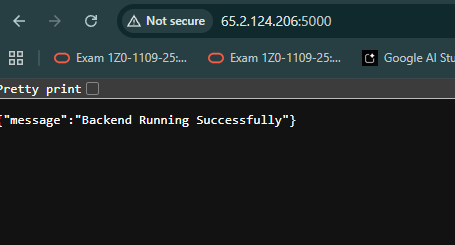
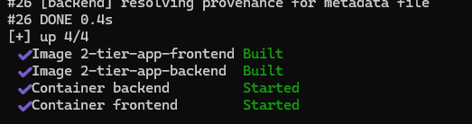
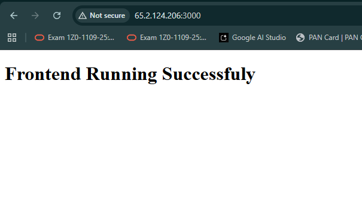
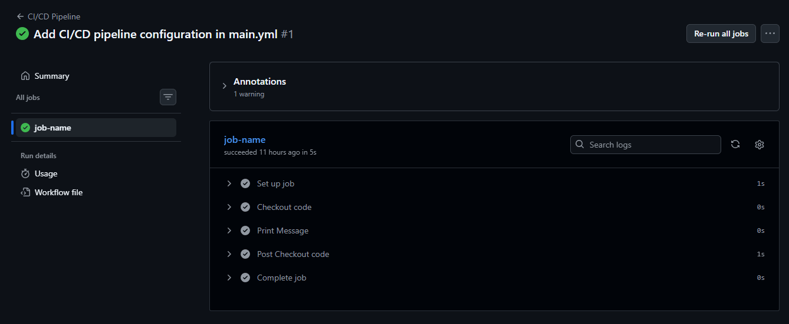

# 🚀 2-Tier Application Deployment Using Docker, AWS ECR & EC2

## 📌 Project Overview

This project demonstrates the complete deployment lifecycle of a **2-Tier Application** using:

- Docker
- AWS ECR
- AWS EC2
- GitHub
- Linux

The project contains:

- 🔹 Frontend Application
- 🔹 Backend Application

This deployment includes:

✅ Dockerization of frontend and backend  
✅ Docker image build process  
✅ AWS ECR image push  
✅ EC2 deployment  
✅ Docker container execution  
✅ Security Group configuration  
✅ Public application hosting  
✅ Linux server management  

---

# 🏗️ Project Architecture


---

# 🛠️ Technologies Used

| Technology | Purpose |
|------------|----------|
| Docker | Containerization |
| AWS ECR | Docker Image Registry |
| AWS EC2 | Application Hosting |
| Git & GitHub | Version Control |
| Linux | Server Environment |
| Node.js | Backend Runtime |
| React.js | Frontend Application |

---

# 📂 Project Structure

```bash
2-tier-ci-cd-project/
│
├── backend/
│   ├── Dockerfile
│   ├── package.json
│   ├── server.js
│   └── .env
│
├── frontend/
│   ├── Dockerfile
│   ├── package.json
│   ├── src/
│   └── public/
│
├── Screenshot/
│ 
│   ├── backend-running.png
│   ├── frontend-running.png
│   ├── workflow.png
│   └── build.png
│
├── README.md
│
└── docker-compose.yml
⚙️ Step 1 — Clone Repository
git clone https://github.com/your-username/2-tier-ci-cd-project.git
cd 2-tier-ci-cd-project
⚙️ Step 2 — Backend Dockerization
📌 Move to Backend Folder
cd backend
📌 Build Backend Docker Image
docker build -t backend-app .
📌 Run Backend Container
docker run -d -p 5000:5000 backend-app
📌 Verify Running Containers
docker ps
🖼️ Backend Running

⚙️ Step 3 — Frontend Dockerization
📌 Move to Frontend Folder
cd ../frontend
📌 Build Frontend Docker Image
docker build -t frontend-app .
📌 Run Frontend Container
docker run -d -p 3000:3000 frontend-app
📌 Verify Running Containers
docker ps
🖼️ Frontend Running

⚙️ Step 4 — Create AWS ECR Repository
📌 Configure AWS CLI
aws configure
📌 Create Backend ECR Repository
aws ecr create-repository --repository-name backend-app
📌 Create Frontend ECR Repository
aws ecr create-repository --repository-name frontend-app
⚙️ Step 5 — Authenticate Docker to AWS ECR
aws ecr get-login-password --region ap-south-1 | docker login --username AWS --password-stdin <AWS_ACCOUNT_ID>.dkr.ecr.ap-south-1.amazonaws.com
⚙️ Step 6 — Tag Docker Images
📌 Backend Image Tag
docker tag backend-app:latest <AWS_ACCOUNT_ID>.dkr.ecr.ap-south-1.amazonaws.com/backend-app:latest
📌 Frontend Image Tag
docker tag frontend-app:latest <AWS_ACCOUNT_ID>.dkr.ecr.ap-south-1.amazonaws.com/frontend-app:latest
⚙️ Step 7 — Push Images to AWS ECR
📌 Push Backend Image
docker push <AWS_ACCOUNT_ID>.dkr.ecr.ap-south-1.amazonaws.com/backend-app:latest
📌 Push Frontend Image
docker push <AWS_ACCOUNT_ID>.dkr.ecr.ap-south-1.amazonaws.com/frontend-app:latest
🖼️ Docker Build Process

⚙️ Step 8 — Launch AWS EC2 Instance
📌 EC2 Configuration
Setting	Value
AMI	Ubuntu
Instance Type	t2.micro
Storage	8 GB
Security Group	Allow 22, 3000, 5000
⚙️ Step 9 — Connect EC2 Instance
ssh -i your-key.pem ubuntu@your-public-ip
⚙️ Step 10 — Install Docker on EC2
sudo apt update
sudo apt install docker.io -y
sudo systemctl start docker
sudo systemctl enable docker
📌 Verify Docker Installation
docker --version
⚙️ Step 11 — Pull Docker Images from ECR
📌 Authenticate Docker Again
aws ecr get-login-password --region ap-south-1 | docker login --username AWS --password-stdin <AWS_ACCOUNT_ID>.dkr.ecr.ap-south-1.amazonaws.com
📌 Pull Backend Image
docker pull <AWS_ACCOUNT_ID>.dkr.ecr.ap-south-1.amazonaws.com/backend-app:latest
📌 Pull Frontend Image
docker pull <AWS_ACCOUNT_ID>.dkr.ecr.ap-south-1.amazonaws.com/frontend-app:latest
⚙️ Step 12 — Run Containers on EC2
📌 Run Backend Container
docker run -d -p 5000:5000 --name backend-container <AWS_ACCOUNT_ID>.dkr.ecr.ap-south-1.amazonaws.com/backend-app:latest
📌 Run Frontend Container
docker run -d -p 3000:3000 --name frontend-container <AWS_ACCOUNT_ID>.dkr.ecr.ap-south-1.amazonaws.com/frontend-app:latest
⚙️ Step 13 — Verify Deployment
📌 Check Running Containers
docker ps
📌 Check Logs
docker logs frontend-container
docker logs backend-container

AWS Security Group Rules
Type	Port

nginx 80
SSH	22
Frontend	3000
Backend	5000
🌐 Application Access
Frontend URL
http://<EC2-PUBLIC-IP>:3000
Backend URL
http://<EC2-PUBLIC-IP>:5000
🚀 Future Enhancements

✅ Kubernetes Deployment (EKS)
✅ Monitoring with Prometheus & Grafana

📸 Screenshots Included
✅ Backend Running
✅ Frontend Running
✅ Workflow Diagram

Pushkar Pandey

# 📸 Project Screenshots

## 🔹 Backend Running


---

## 🔹 Docker Image Build


---

## 🔹 Frontend Running


---

## 🔹 GitHub Actions Workflow


Next K8S 


